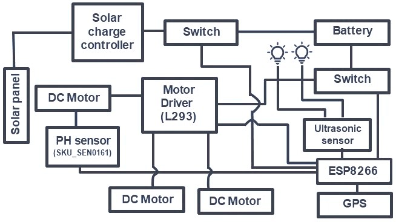
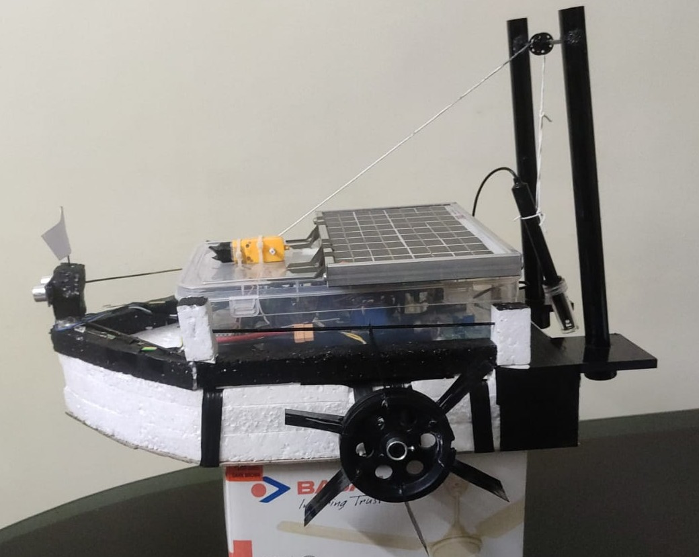
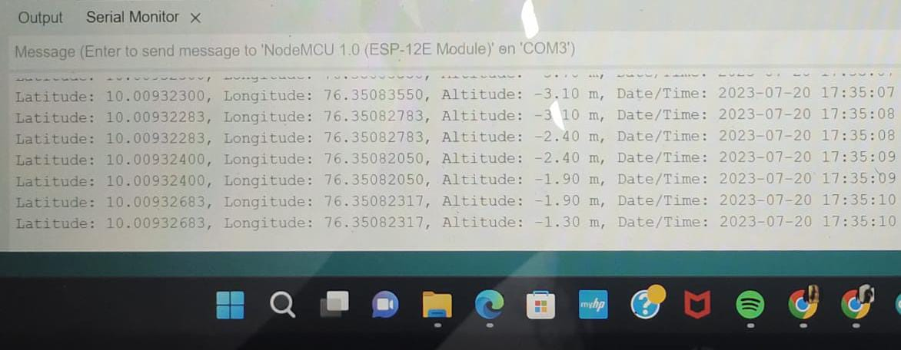
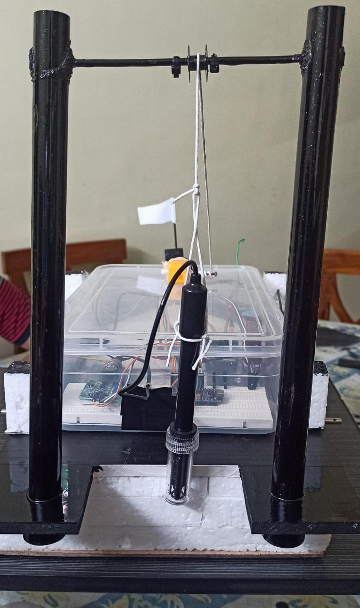
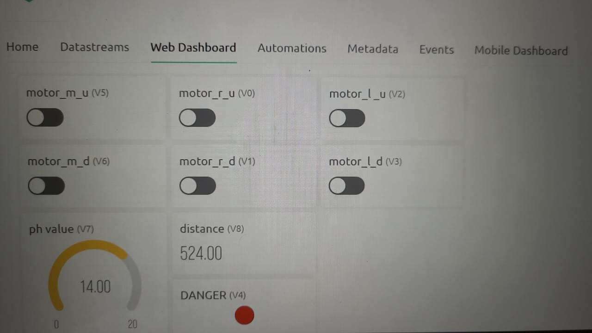

# Oil Spillage Detection & Monitoring Boat

An IoT-enabled prototype for experimental oil-spill monitoring using an ESP8266, pH sensing, GPS tracking, ultrasonic obstacle detection, remote control, and solar power.

## Overview

Oil spills can cause significant damage to marine ecosystems and coastal environments. This project explores a small unmanned surface vehicle designed to assist with detecting abnormal water conditions and recording the location of suspected contamination.

The prototype combines embedded systems, sensors, wireless communication, and renewable power into a single platform.

> **Note:** This is an academic/experimental prototype. The pH-based detection method should not be considered a standalone or production-grade method for identifying hydrocarbons.

## Key Features

- 🌊 Experimental water-quality anomaly detection using a pH sensor
- 📍 GPS-based location tracking
- 🚤 Remote boat navigation
- 🚧 Ultrasonic obstacle detection
- 📡 ESP8266-based wireless connectivity
- 📱 Blynk IoT dashboard for remote monitoring and control
- ☀️ Solar-powered charging system
- 🔋 Battery-powered operation
- ⚙️ Motorized sensor arm for controlled sensor deployment

## System Architecture

The main controller is an **ESP8266**, which interfaces with the project's sensors and actuators.

```text
                  ┌─────────────────┐
                  │   Solar Panel   │
                  └────────┬────────┘
                           │
                  ┌────────▼────────┐
                  │ Charge Controller│
                  └────────┬────────┘
                           │
                     ┌─────▼─────┐
                     │  Battery  │
                     └─────┬─────┘
                           │
              ┌────────────▼────────────┐
              │        ESP8266          │
              │    Main Controller      │
              └───┬────┬────┬────┬─────┘
                  │    │    │    │
          ┌───────┘    │    │    └────────┐
          ▼            ▼    ▼             ▼
      pH Sensor       GPS  Ultrasonic   Blynk IoT
          │
          ▼
     Sensor Arm

              ESP8266
                 │
                 ▼
            Motor Driver
                 │
            ┌────┴────┐
            ▼         ▼
         Motor      Motor

```
## Hardware & Technologies

| Component | Purpose |
|---|---|
| ESP8266 | Main controller and Wi-Fi connectivity |
| pH Sensor | Experimental water-quality monitoring |
| GPS Module | Location tracking |
| Ultrasonic Sensor | Obstacle detection |
| Motor Driver | Controls the boat motors |
| DC Motors | Boat propulsion |
| Servo Motor | Controls the sensor arm |
| Battery | Power storage |
| Solar Panel | Renewable charging |
| Blynk IoT | Remote monitoring and control |
| Arduino IDE | Firmware development |

## How It Works

1. The **ESP8266** acts as the main controller for the system.
2. The **pH sensor** is deployed into the water using a motorized sensor arm.
3. Sensor measurements can be monitored through the **Blynk IoT interface**.
4. The **GPS module** records the approximate location of measurements.
5. The **ultrasonic sensor** provides basic obstacle detection during navigation.
6. The motor driver controls the boat's propulsion system.
7. A **solar panel and battery system** provide the project's power source.

## 📷 Project Visuals

### System Architecture



### Prototype



### GPS Tracking



### pH Sensor



### Blynk IoT Interface



## Prototype Results

The project resulted in a working academic prototype integrating:

- ESP8266-based control
- Water-quality sensing
- GPS tracking
- Ultrasonic obstacle detection
- Remote motor control
- Blynk IoT monitoring
- Solar-powered charging

The prototype demonstrates the feasibility of combining low-cost embedded systems and IoT technologies for experimental environmental monitoring.

## Limitations

- pH measurements alone cannot reliably identify hydrocarbons.
- Sensor calibration is required for meaningful measurements.
- The prototype is not designed for autonomous open-water deployment.
- Environmental conditions can affect sensor and GPS measurements.
- Additional hydrocarbon-specific sensing would be required for practical oil-spill detection.

## Future Improvements

- Hydrocarbon-specific sensors
- Autonomous GPS navigation
- Improved collision avoidance
- Real-time map visualization
- Camera-based monitoring
- Machine-learning-based anomaly detection
- Cloud-based data logging
- Improved marine-grade hardware

## Skills Demonstrated

**Embedded Systems · IoT · ESP8266 · Sensor Integration · GPS · Blynk · Arduino · Motor Control · Wireless Communication · Hardware Prototyping · Environmental Monitoring**

## Project Context

This project was developed as an academic engineering project and demonstrates the design and integration of an IoT-enabled environmental monitoring prototype.

The focus of this repository is the engineering implementation and technical learning, rather than presenting the prototype as a production-ready environmental monitoring system.

## Contributors

Developed as a collaborative engineering project.

## License

This project is provided for educational and research purposes.
